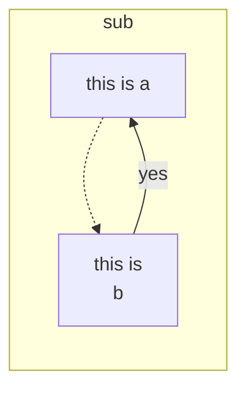

# training

for trainig

## main branch

this message is writen in main branch

## branch issue1

this is a comment from branch-issue1

## add text from b1

this is a comment from b1

## add line on May09, 2023

## add some text

## from branch1

This text was written in branch1
